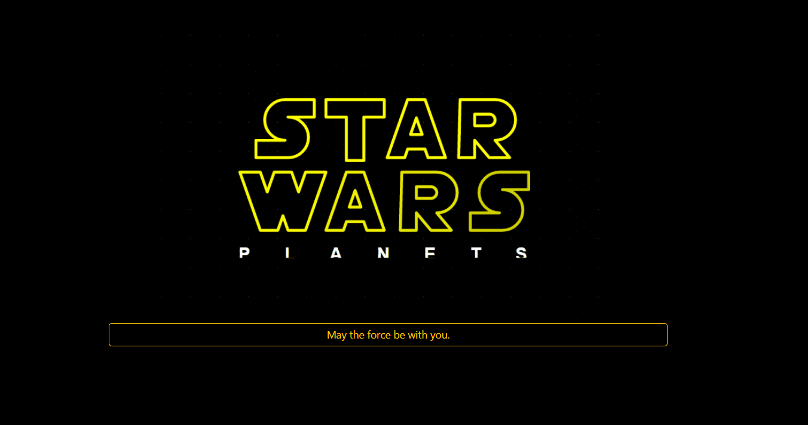
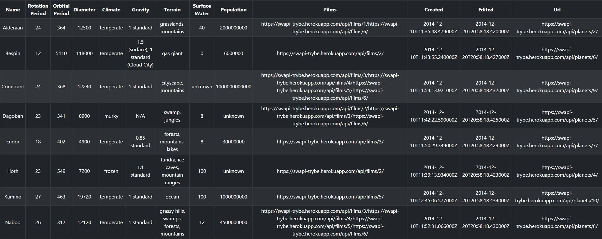

# Star Wars DataTable - React, Context API e Bootstrap

[](https://sonarcloud.io/summary/new_code?id=vitorbss12_StarWars-React-DataTable)
[](https://sonarcloud.io/summary/new_code?id=vitorbss12_StarWars-React-DataTable)
[](https://sonarcloud.io/summary/new_code?id=vitorbss12_StarWars-React-DataTable)
[](https://sonarcloud.io/summary/new_code?id=vitorbss12_StarWars-React-DataTable)

Star Wars DataTable é uma aplicação com informações sobre os planetas da famosa franquia de Star Wars, consumindo uma API disponibilizada pela [Trybe](https://www.betrybe.com/) é possível ver os planetas listados em uma tabela, também é possível fazer buscas, aplicar filtros e ordenar os dados. A aplicação foi desenvolvida utilizando React e seus componentes funcionais, Context API, hooks customizados e parte da estilização é feita com React Bootstrap.

É possível testar a aplicação aqui: [Star Wars DataTable](https://vitorbss12.github.io/StarWars-React-DataTable/) 


## Conteúdo

- [Star Wars DataTable - React, Context API e Bootstrap](#star-wars-datatable---react-context-api-e-bootstrap)
  - [Conteúdo](#conteúdo)
- [**Recursos Star Wars Data Table**](#recursos-star-wars-data-table)
    - [**Apresentação**](#apresentação)
    - [**Menu Inicial**](#menu-inicial)
    - [**Filtragem e Ordenação**](#filtragem-e-ordenação)
      - [**Filtrar Planetas**](#filtrar-planetas)
      - [**Ordenar Planetas**](#ordenar-planetas)
      - [**Filtros Aplicados**](#filtros-aplicados)
    - [**Tabela**](#tabela)
- [**Instruções**](#instruções)
    - [**Instalação**](#instalação)
    - [**Execução**](#execução)
- [**Linguagens e Ferramentas**](#linguagens-e-ferramentas)
    - [**React**](#react)
    - [**React Hooks**](#react-hooks)
    - [**Context API**](#context-api)
    - [**Bootstrap**](#bootstrap)
    - [**Planets List API - Trybe**](#planets-list-api---trybe)
    - [**Linter**](#linter)
- [**Observações**](#observações)

# **Recursos Star Wars Data Table**

### **Apresentação**

A tela inicial da aplicação é responsiva e ocupa 100% do espaço disponível no navegador, possui um botão ancorado a parte funcional da tabela de planetas.



### **Menu Inicial**

O menu inicial é composto pelo título da aplicação, uma barra de busca capaz de filtrar os planetas por nome e um botão para expandir os filtros e ordenações disponíveis, esse botão não oculta filtros já aplicados.


### **Filtragem e Ordenação**

É possível filtrar e e gerenciar filtros já aplicados na tabela, assim como ordenar de forma crescente ou decrescente.


#### **Filtrar Planetas**

As opções de filtro são de acordo com as colunas disponíveis na tabela (período orbital, diâmetro, período de rotação, água da superfície e população), um operador (maior que, menor que e igual a) e o valor desejado.
Apenas um filtro por coluna pode ser aplicado por vez.

#### **Ordenar Planetas**

A ordenação pode ser feita com base nas mesmas colunas disponíveis para os filtros e com opção de ordem ascendente ou descendente.

#### **Filtros Aplicados**

O menu de filtros aplicados só é visível quando existe mais de um filtro selecionado, é possível aplicar até 3 filtros utilizando colunas distintas. Os botões permitem excluir filtros específicos ou todos de uma vez.


### **Tabela**

A tabela contém os planetas recebidos pela API e é dinâmica de acordo com as configurações de filtragem e ordenação. Foi desenvolvida utilizando Bootstrap se mantendo responsiva de acordo com o tamanho do dispositivo.


<b>Demo Tabela</b>

# **Instruções**

### **Instalação**

Para rodar a aplicação localmente é necessário fazer a instalação das dependências utilizadas com o comando:

```
npm install
```
### **Execução**

Depois de ter as dependências instaladas é possível executar o projeto localmente com o comando:

```
npm start
```

# **Linguagens e Ferramentas**

`React` é o coração da aplicação, foi desenvolvida utilizando componentes funcionais, `Hooks` disponíveis pelo React e também customizados, o estado da aplicação foi gerido utilizando `Context API` e a estilização foi feita com `Bootstrap` e `CSS`

### **React**

A aplicação foi componentizada utilizando `React`, divido em:
- **StarWarsData:** Onde todos os componentes são agrupados.
- **Header:** Responsável pela visualização inicial.
- **TextInput:** Capaz de fazer a filtragem de planetas pelo nome.
- **NumbersInputs:** Onde são gerenciadas as opções de filtragem.
- **SortInputs:** Opções de ordenação.
- **AppliedFilters:** Filtros aplicados e opções de exclusão.
- **Table:** Exibição da tabela dinamicamente.

### **React Hooks**

Os principais hooks utilizados na aplicação foram `useState` e `useContext` (a seguir), também foi desenvolvido hooks customizados, sendo eles:
  - **useFetchAPI:** Responsável por fazer a requisição ao endpoint da API.
  - **useFilterPlanets:** Efetuando a filtragem dos planetas e guardando no contexto da aplicação.
  - **useSortPlanets:** Efetuando a ordenação dos planetas e guardando no contexto da aplicação.

### **Context API**

`Context API` ficou responsável pelo estado global da aplicação utilizando o StarWarsContext para gerenciar alterações na busca por nome, filtros e ordenação aplicados. Faz também a verificação de possíveis erros na requisição da API e o loading da requisição.

### **Bootstrap**

A aplicação teve parte da estilização feita em `CSS`, mas para manter uma boa responsividade o `Bootstrap` foi escolhido. Containers, Linhas e Colunas são importadas da biblioteca pra manter um layout mais organizado, assim com animações de loadings, alguns botões e principalmente a tabela, que se comporta de forma responsiva.

### **Planets List API - Trybe**

O consumo da api foi feito por apenas um endpoint dentro do hook customizado useFetchApi, com retorno de todos os planetas disponíveis, e a partir dessa requisição a aplicação gerencia os planetas que devem ser exibidos na tabela.

Endpoint Utilizado:
```
https://swapi-trybe.herokuapp.com/api/planets/
```

### **Linter**

Este projeto foi desenvolvido utilizando o linter `ESLint` seguindo as boas práticas definidas na [Trybe](https://www.betrybe.com/).

Para executar o Lint utilize o comando:
````
npm run lint
````

Para executar o StyleLint utilize o comando:
````
npm run lint:styles
````

# **Observações**

- Este é um projeto de estudo desenvolvido durante minha formação na [Trybe](https://www.betrybe.com/). :rocket:

- Este repositório está sendo monitorado pelo [SonarCloud](https://sonarcloud.io/) para avaliação de qualidade.

- O deploy dessa aplicação foi feito utilizando [GitHub Pages](https://pages.github.com/)

- Quer saber mais sobre mim? Veja o meu [LinkedIn](https://www.linkedin.com/in/vitorbss/).
